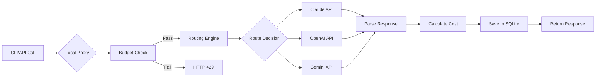

## One-Minute Quickstart | 一分钟体验

```bash
# Install (Go 1.25+) | 安装
go install github.com/royisme/bobamixer/cmd/boba@latest

# Initialize configuration | 初始化配置
boba init

# Configure API keys | 配置API密钥
export ANTHROPIC_API_KEY="sk-ant-..."
export OPENAI_API_KEY="sk-..."

# Launch interactive Dashboard | 启动交互式Dashboard
boba

# View usage statistics | 查看使用统计
boba stats --7d --by-profile

# Test smart routing | 测试智能路由
boba route test "Review this code for security issues"
```

## Why BobaMixer?

<div class="vp-doc" style="margin-top: 2rem;">

### 🔑 Unified Secret Management | 统一密钥管理

**No more scattered API keys across multiple config files**. `secrets.yaml` + environment variable priority strategy, secure and flexible.

**不再需要在多个配置文件中维护API密钥**。secrets.yaml + 环境变量优先级策略,安全且灵活。

### 💸 Cost Control | 成本可控

**Real-time budget tracking, pre-request checks, automatic alerts**. From "billing surprises" to "cost predictability".

**实时预算追踪,请求前检查,自动告警**。从 "账单惊喜" 到 "成本可控"。

### 🎯 Intelligent Scheduling | 智能调度

**Automatically select models based on task characteristics**: Long context → Claude, Code review → GPT-4, Tight budget → Gemini Flash.

**根据任务特征自动选择模型**: 长上下文用Claude,代码审查用GPT-4,预算紧张用Gemini Flash。

### 📈 Data-Driven | 数据驱动

**Precise Token/Cost/Latency tracking**, multi-dimensional analysis reports, providing data support for optimization decisions.

**精确的Token/Cost/Latency追踪**,多维度分析报告,为优化决策提供数据支撑。

### ⚡ Zero-Intrusion Integration | 零侵入集成

**Just modify the `ANTHROPIC_BASE_URL` environment variable**, no code changes needed to access Proxy monitoring.

**只需修改环境变量ANTHROPIC_BASE_URL**,无需改动代码即可接入Proxy监控。

### 🏗️ Go Best Practices | Go最佳实践

**Strictly follows Go conventions**, golangci-lint 0 issues, complete documentation comments, concurrency-safe, graceful error handling.

**严格遵循Go规范**,golangci-lint 0 issues,完整文档注释,并发安全,错误处理优雅。

</div>

## Core Workflow | 核心工作流



## Technical Highlights | 技术亮点

### Architecture Design | 架构设计

- **Control Plane Pattern**: Inspired by Kubernetes design philosophy, separation of configuration and execution

  **Control Plane模式**: 借鉴Kubernetes设计理念,配置与执行分离

- **Multi-layer Fallback**: OpenRouter API → Cache → Vendor JSON → pricing.yaml → profiles.yaml

  **多层Fallback**: OpenRouter API → Cache → Vendor JSON → pricing.yaml → profiles.yaml

- **Epsilon-Greedy**: Automatic balance between cost optimization (exploitation) and effectiveness exploration (exploration)

  **Epsilon-Greedy**: 在成本优化(exploitation)和效果探索(exploration)之间自动平衡

### Engineering Quality | 工程质量

- ✅ **0 Lint Issues** - Strict golangci-lint validation | golangci-lint严格验证
- ✅ **Type Safe** - Complete type definitions, avoid map[string]any | 完整的类型定义,避免map[string]any
- ✅ **Concurrency Safe** - sync.RWMutex protects shared state | sync.RWMutex保护共享状态
- ✅ **Graceful Degradation** - All external dependencies have fallbacks | 所有外部依赖都有Fallback
- ✅ **Secure Coding** - All exceptions audited with #nosec | 通过#nosec审计所有例外

### Performance Optimization | 性能优化

- **Request-level Concurrency**: Proxy supports 1000+ RPS | Proxy支持1000+ RPS
- **Caching Strategy**: 24-hour pricing cache, reduces API calls | 24小时定价缓存,减少API调用
- **SQLite WAL Mode**: Concurrent read/write optimization | 并发读写优化
- **Lazy Loading**: Configuration files loaded on demand | 配置文件按需加载

## Real-World Use Cases | 实际案例

### Case 1: AI Startup Company | 案例1: 某AI初创公司

**Challenge | 挑战**: Monthly API costs $2000+, lack of visibility, budget out of control

月度API成本$2000+,缺乏可见性,预算失控

**Solution | 方案**:
- Enabled Proxy monitoring, identified high-frequency call paths | 启用Proxy监控,识别高频调用路径
- Set project-level budget ($50/day) | 设置项目级预算($50/day)
- Route dev environment to cheap models (Claude Haiku) | 开发环境路由到便宜模型(Claude Haiku)
- Keep high-quality models for production (GPT-4) | 生产环境保持高质量模型(GPT-4)

**Results | 结果**:
- **45% cost reduction** ($2000 → $1100/month) | 成本降低45% ($2000 → $1100/月)
- **30% lower P95 latency** (improved cache hit rate) | P95延迟降低30% (缓存命中提升)
- **0 false budget alerts** | 预算超限告警0次误报

### Case 2: Open Source Maintainer | 案例2: 开源项目维护者

**Challenge | 挑战**: Personal project, limited budget ($100/month), need code review assistant

个人项目,预算有限($100/月),需要代码审查助手

**Solution | 方案**:
- Smart routing rules: Simple questions → Gemini Flash, Complex reviews → Claude

  智能路由规则: 简单问题用Gemini Flash,复杂审查用Claude

- Budget control: `--daily 3.00 --cap 100.00` | 预算控制: --daily 3.00 --cap 100.00
- Git Hooks: Automatically record AI calls for each commit | Git Hooks: 自动记录每次commit的AI调用

**Results | 结果**:
- **100% budget achievement** ($98.50/$100) | 100%预算达成($98.50/$100)
- **200+ commits auto-reviewed** | 200+ commits自动审查
- **Average review cost $0.49** | 平均每次审查成本 $0.49

## Quick Links | 快速链接

<div class="vp-doc">
  <div class="custom-block tip">
    <p class="custom-block-title">🚀 New User Guide | 新用户指南</p>
    <p>
      <a href="/guide/installation">Installation</a> →
      <a href="/guide/getting-started">Quick Start</a> →
      <a href="/guide/configuration">Configuration</a>
    </p>
  </div>

  <div class="custom-block info">
    <p class="custom-block-title">📚 Feature Documentation | 功能文档</p>
    <p>
      <a href="/features/routing">Smart Routing</a> |
      <a href="/features/budgets">Budget Management</a> |
      <a href="/features/analytics">Usage Analytics</a> |
      <a href="/features/adapters">Adapter Integration</a>
    </p>
  </div>

  <div class="custom-block warning">
    <p class="custom-block-title">🔧 Developer Resources | 开发者资源</p>
    <p>
      <a href="/reference/cli">CLI Reference</a> |
      <a href="/reference/config-files">Configuration Files</a> |
      <a href="/advanced/troubleshooting">Troubleshooting</a>
    </p>
  </div>
</div>

## Development Progress | 开发进度

- [x] **Phase 1**: Control Plane (Provider/Tool/Binding management) - **100% Complete** ✅

  控制平面 (Provider/Tool/Binding管理) - **100% 完成** ✅

- [x] **Phase 1.5**: OpenAI/Gemini Integration - **100% Complete** ✅

  OpenAI/Gemini集成 - **100% 完成** ✅

- [x] **Phase 2**: HTTP Proxy & Usage Monitoring - **100% Complete** ✅

  HTTP Proxy & Usage监控 - **100% 完成** ✅

- [x] **Phase 3**: Smart Routing & Budget Control & Automatic Pricing - **100% Complete** ✅

  智能路由 & 预算控制 & 定价自动获取 - **100% 完成** ✅

- [ ] **Phase 4**: Web Dashboard (Optional feature, TUI is already powerful enough)

  Web Dashboard (可选功能,TUI已足够强大)

- [ ] **Phase 5**: Multi-user Collaboration Mode (Enterprise feature)

  多用户协作模式 (企业功能)

**🎉 Current Status**: All core features fully implemented **(Overall Completion: 100%)**

**🎉 当前状态**: 所有核心功能已完整实现 **(总体完成度 100%)**

### Completed Features List | 已实现的完整功能列表

- ✅ Unified Control Plane (Provider/Tool/Binding management) | 统一控制平面(Provider/Tool/Binding管理)
- ✅ Local HTTP Proxy (127.0.0.1:7777) | 本地HTTP Proxy(127.0.0.1:7777)
- ✅ Smart Routing Engine (routes.yaml + Epsilon-Greedy) | 智能路由引擎(routes.yaml + Epsilon-Greedy)
- ✅ Budget Management (`boba budget` command) | 预算管理(`boba budget`命令)
- ✅ Real-time Pricing Updates (OpenRouter API + Multi-layer Fallback) | 实时定价更新(OpenRouter API + 多层Fallback)
- ✅ Usage Statistics (`boba stats` + Dashboard Stats view) | 使用统计(`boba stats` + Dashboard Stats视图)
- ✅ Git Hooks Integration (`boba hooks`) | Git Hooks集成(`boba hooks`)
- ✅ Optimization Advisor (`boba action`) | 优化建议引擎(`boba action`)
- ✅ TUI Dashboard (Bubble Tea + View switching) | TUI Dashboard(Bubble Tea + 视图切换)
- ✅ 15+ CLI commands fully implemented | 15+ CLI命令全部实现

## Community & Support | 社区与支持

- 📖 [Complete Documentation](https://royisme.github.io/BobaMixer/) | [完整文档](https://royisme.github.io/BobaMixer/)
- 🐛 [Issue Tracker](https://github.com/royisme/BobaMixer/issues) | [问题反馈](https://github.com/royisme/BobaMixer/issues)
- 💬 [Discussions](https://github.com/royisme/BobaMixer/discussions) | [讨论区](https://github.com/royisme/BobaMixer/discussions)
- 🤝 [Contributing Guide](https://github.com/royisme/BobaMixer/blob/main/CONTRIBUTING.md) | [贡献指南](https://github.com/royisme/BobaMixer/blob/main/CONTRIBUTING.md)

## License | 开源协议

MIT License - See [LICENSE](https://github.com/royisme/BobaMixer/blob/main/LICENSE) for details

MIT License - 详见 [LICENSE](https://github.com/royisme/BobaMixer/blob/main/LICENSE)

---

<div style="text-align: center; margin-top: 2rem; color: #666;">
  <p><strong>Reduce AI costs by 50% in the time it takes to drink a bubble tea ☕🧋</strong></p>
  <p><strong>用一杯珍珠奶茶的时间,让AI成本降低50%</strong></p>
  <p style="font-size: 0.9em;">Made with ❤️ by developers, for developers</p>
</div>
