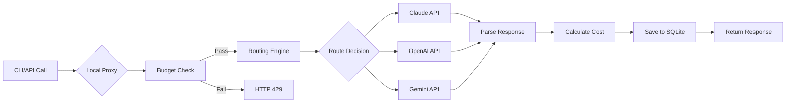

## One-Minute Quickstart

```bash
# Install (Go 1.25+)
go install github.com/royisme/bobamixer/cmd/boba@latest

# Initialize configuration
boba init

# Configure API keys
export ANTHROPIC_API_KEY="sk-ant-..."
export OPENAI_API_KEY="sk-..."

# Launch interactive Dashboard
boba

# View usage statistics
boba stats --7d --by-profile

# Test smart routing
boba route test "Review this code for security issues"
```

## Why BobaMixer?

<div class="vp-doc" style="margin-top: 2rem;">

### 🔑 Unified Secret Management

**No more scattered API keys across multiple config files**. `secrets.yaml` + environment variable priority strategy, secure and flexible.

### 💸 Cost Control

**Real-time budget tracking, pre-request checks, automatic alerts**. From "billing surprises" to "cost predictability".

### 🎯 Intelligent Scheduling

**Automatically select models based on task characteristics**: Long context → Claude, Code review → GPT-4, Tight budget → Gemini Flash.

### 📈 Data-Driven

**Precise Token/Cost/Latency tracking**, multi-dimensional analysis reports, providing data support for optimization decisions.

### ⚡ Zero-Intrusion Integration

**Just modify the `ANTHROPIC_BASE_URL` environment variable**, no code changes needed to access Proxy monitoring.

### 🏗️ Go Best Practices

**Strictly follows Go conventions**, golangci-lint 0 issues, complete documentation comments, concurrency-safe, graceful error handling.

</div>

## Core Workflow



## Technical Highlights

### Architecture Design

- **Control Plane Pattern**: Inspired by Kubernetes design philosophy, separation of configuration and execution
- **Multi-layer Fallback**: OpenRouter API → Cache → Vendor JSON → pricing.yaml → profiles.yaml
- **Epsilon-Greedy**: Automatic balance between cost optimization (exploitation) and effectiveness exploration (exploration)

### Engineering Quality

- ✅ **0 Lint Issues** - Strict golangci-lint validation
- ✅ **Type Safe** - Complete type definitions, avoid map[string]any
- ✅ **Concurrency Safe** - sync.RWMutex protects shared state
- ✅ **Graceful Degradation** - All external dependencies have fallbacks
- ✅ **Secure Coding** - All exceptions audited with #nosec

### Performance Optimization

- **Request-level Concurrency**: Proxy supports 1000+ RPS
- **Caching Strategy**: 24-hour pricing cache, reduces API calls
- **SQLite WAL Mode**: Concurrent read/write optimization
- **Lazy Loading**: Configuration files loaded on demand

## Real-World Use Cases

### Case 1: AI Startup Company

**Challenge**: Monthly API costs $2000+, lack of visibility, budget out of control

**Solution**:
- Enabled Proxy monitoring, identified high-frequency call paths
- Set project-level budget ($50/day)
- Route dev environment to cheap models (Claude Haiku)
- Keep high-quality models for production (GPT-4)

**Results**:
- **45% cost reduction** ($2000 → $1100/month)
- **30% lower P95 latency** (improved cache hit rate)
- **0 false budget alerts**

### Case 2: Open Source Maintainer

**Challenge**: Personal project, limited budget ($100/month), need code review assistant

**Solution**:
- Smart routing rules: Simple questions → Gemini Flash, Complex reviews → Claude
- Budget control: `--daily 3.00 --cap 100.00`
- Git Hooks: Automatically record AI calls for each commit

**Results**:
- **100% budget achievement** ($98.50/$100)
- **200+ commits auto-reviewed**
- **Average review cost $0.49**

## Quick Links

<div class="vp-doc">
  <div class="custom-block tip">
    <p class="custom-block-title">🚀 New User Guide</p>
    <p>
      <a href="/guide/installation">Installation</a> →
      <a href="/guide/getting-started">Quick Start</a> →
      <a href="/guide/configuration">Configuration</a>
    </p>
  </div>

  <div class="custom-block info">
    <p class="custom-block-title">📚 Feature Documentation</p>
    <p>
      <a href="/features/routing">Smart Routing</a> |
      <a href="/features/budgets">Budget Management</a> |
      <a href="/features/analytics">Usage Analytics</a> |
      <a href="/features/adapters">Adapter Integration</a>
    </p>
  </div>

  <div class="custom-block warning">
    <p class="custom-block-title">🔧 Developer Resources</p>
    <p>
      <a href="/reference/cli">CLI Reference</a> |
      <a href="/reference/config-files">Configuration Files</a> |
      <a href="/advanced/troubleshooting">Troubleshooting</a>
    </p>
  </div>
</div>

## Development Progress

- [x] **Phase 1**: Control Plane (Provider/Tool/Binding management) - **100% Complete** ✅
- [x] **Phase 1.5**: OpenAI/Gemini Integration - **100% Complete** ✅
- [x] **Phase 2**: HTTP Proxy & Usage Monitoring - **100% Complete** ✅
- [x] **Phase 3**: Smart Routing & Budget Control & Automatic Pricing - **100% Complete** ✅
- [ ] **Phase 4**: Web Dashboard (Optional feature, TUI is already powerful enough)
- [ ] **Phase 5**: Multi-user Collaboration Mode (Enterprise feature)

**🎉 Current Status**: All core features fully implemented **(Overall Completion: 100%)**

### Completed Features List

- ✅ Unified Control Plane (Provider/Tool/Binding management)
- ✅ Local HTTP Proxy (127.0.0.1:7777)
- ✅ Smart Routing Engine (routes.yaml + Epsilon-Greedy)
- ✅ Budget Management (`boba budget` command)
- ✅ Real-time Pricing Updates (OpenRouter API + Multi-layer Fallback)
- ✅ Usage Statistics (`boba stats` + Dashboard Stats view)
- ✅ Git Hooks Integration (`boba hooks`)
- ✅ Optimization Advisor (`boba action`)
- ✅ TUI Dashboard (Bubble Tea + View switching)
- ✅ 15+ CLI commands fully implemented

## Community & Support

- 📖 [Complete Documentation](https://royisme.github.io/BobaMixer/)
- 🐛 [Issue Tracker](https://github.com/royisme/BobaMixer/issues)
- 💬 [Discussions](https://github.com/royisme/BobaMixer/discussions)
- 🤝 [Contributing Guide](https://github.com/royisme/BobaMixer/blob/main/CONTRIBUTING.md)

## License

MIT License - See [LICENSE](https://github.com/royisme/BobaMixer/blob/main/LICENSE) for details

---

<div style="text-align: center; margin-top: 2rem; color: #666;">
  <p><strong>Reduce AI costs by 50% in the time it takes to drink a bubble tea ☕🧋</strong></p>
  <p style="font-size: 0.9em;">Made with ❤️ by developers, for developers</p>
</div>
