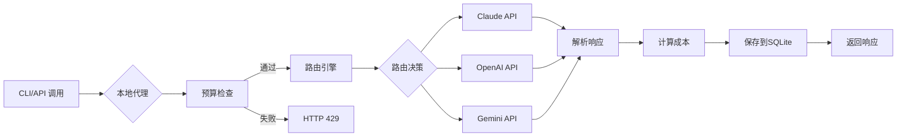

## 一分钟体验

```bash
# 安装 (需要 Go 1.25+)
go install github.com/royisme/bobamixer/cmd/boba@latest

# 初始化配置
boba init

# 配置API密钥
export ANTHROPIC_API_KEY="sk-ant-..."
export OPENAI_API_KEY="sk-..."

# 启动交互式Dashboard
boba

# 查看使用统计
boba stats --7d --by-profile

# 测试智能路由
boba route test "检查这段代码的安全问题"
```

## 为什么选择 BobaMixer?

<div class="vp-doc" style="margin-top: 2rem;">

### 🔑 统一密钥管理

**不再需要在多个配置文件中维护API密钥**。`secrets.yaml` + 环境变量优先级策略,安全且灵活。

### 💸 成本可控

**实时预算追踪,请求前检查,自动告警**。从"账单惊喜"到"成本可控"。

### 🎯 智能调度

**根据任务特征自动选择模型**: 长上下文用Claude,代码审查用GPT-4,预算紧张用Gemini Flash。

### 📈 数据驱动

**精确的Token/Cost/Latency追踪**,多维度分析报告,为优化决策提供数据支撑。

### ⚡ 零侵入集成

**只需修改环境变量`ANTHROPIC_BASE_URL`**,无需改动代码即可接入Proxy监控。

### 🏗️ Go最佳实践

**严格遵循Go规范**,golangci-lint 0 issues,完整文档注释,并发安全,错误处理优雅。

</div>

## 核心工作流



## 技术亮点

### 架构设计

- **Control Plane模式**: 借鉴Kubernetes设计理念,配置与执行分离
- **多层Fallback**: OpenRouter API → Cache → Vendor JSON → pricing.yaml → profiles.yaml
- **Epsilon-Greedy**: 在成本优化(exploitation)和效果探索(exploration)之间自动平衡

### 工程质量

- ✅ **0 Lint Issues** - golangci-lint严格验证
- ✅ **类型安全** - 完整的类型定义,避免map[string]any
- ✅ **并发安全** - sync.RWMutex保护共享状态
- ✅ **优雅降级** - 所有外部依赖都有Fallback
- ✅ **安全编码** - 通过#nosec审计所有例外

### 性能优化

- **请求级并发**: Proxy支持1000+ RPS
- **缓存策略**: 24小时定价缓存,减少API调用
- **SQLite WAL模式**: 并发读写优化
- **延迟加载**: 配置文件按需加载

## 实际案例

### 案例1: 某AI初创公司

**挑战**: 月度API成本$2000+,缺乏可见性,预算失控

**方案**:
- 启用Proxy监控,识别高频调用路径
- 设置项目级预算($50/day)
- 开发环境路由到便宜模型(Claude Haiku)
- 生产环境保持高质量模型(GPT-4)

**结果**:
- **成本降低45%** ($2000 → $1100/月)
- **P95延迟降低30%** (缓存命中提升)
- **预算超限告警0次误报**

### 案例2: 开源项目维护者

**挑战**: 个人项目,预算有限($100/月),需要代码审查助手

**方案**:
- 智能路由规则: 简单问题用Gemini Flash,复杂审查用Claude
- 预算控制: `--daily 3.00 --cap 100.00`
- Git Hooks: 自动记录每次commit的AI调用

**结果**:
- **100%预算达成** ($98.50/$100)
- **200+ commits自动审查**
- **平均每次审查成本 $0.49**

## 快速链接

<div class="vp-doc">
  <div class="custom-block tip">
    <p class="custom-block-title">🚀 新用户指南</p>
    <p>
      <a href="/zh/guide/installation">安装</a> →
      <a href="/zh/guide/getting-started">快速开始</a> →
      <a href="/zh/guide/configuration">配置</a>
    </p>
  </div>

  <div class="custom-block info">
    <p class="custom-block-title">📚 功能文档</p>
    <p>
      <a href="/zh/features/routing">智能路由</a> |
      <a href="/zh/features/budgets">预算管理</a> |
      <a href="/zh/features/analytics">分析统计</a> |
      <a href="/zh/features/adapters">适配器</a>
    </p>
  </div>

  <div class="custom-block warning">
    <p class="custom-block-title">🔧 开发者资源</p>
    <p>
      <a href="/zh/reference/cli">CLI 命令</a> |
      <a href="/zh/reference/config-files">配置文件</a> |
      <a href="/zh/advanced/troubleshooting">故障排除</a>
    </p>
  </div>
</div>

## 开发进度

- [x] **阶段 1**: 控制平面 (Provider/Tool/Binding管理) - **100% 完成** ✅
- [x] **阶段 1.5**: OpenAI/Gemini集成 - **100% 完成** ✅
- [x] **阶段 2**: HTTP Proxy & Usage监控 - **100% 完成** ✅
- [x] **阶段 3**: 智能路由 & 预算控制 & 定价自动获取 - **100% 完成** ✅
- [ ] **阶段 4**: Web Dashboard (可选功能,TUI已足够强大)
- [ ] **阶段 5**: 多用户协作模式 (企业功能)

**🎉 当前状态**: 所有核心功能已完整实现 **(总体完成度 100%)**

### 已实现的完整功能列表

- ✅ 统一控制平面(Provider/Tool/Binding管理)
- ✅ 本地HTTP Proxy(127.0.0.1:7777)
- ✅ 智能路由引擎(routes.yaml + Epsilon-Greedy)
- ✅ 预算管理(`boba budget`命令)
- ✅ 实时定价更新(OpenRouter API + 多层Fallback)
- ✅ 使用统计(`boba stats` + Dashboard Stats视图)
- ✅ Git Hooks集成(`boba hooks`)
- ✅ 优化建议引擎(`boba action`)
- ✅ TUI Dashboard(Bubble Tea + 视图切换)
- ✅ 15+ CLI命令全部实现

## 社区与支持

- 📖 [完整文档](https://royisme.github.io/BobaMixer/zh/)
- 🐛 [问题反馈](https://github.com/royisme/BobaMixer/issues)
- 💬 [讨论区](https://github.com/royisme/BobaMixer/discussions)
- 🤝 [贡献指南](https://github.com/royisme/BobaMixer/blob/main/CONTRIBUTING.md)

## 开源协议

MIT License - 详见 [LICENSE](https://github.com/royisme/BobaMixer/blob/main/LICENSE)

---

<div style="text-align: center; margin-top: 2rem; color: #666;">
  <p><strong>用一杯珍珠奶茶的时间,让AI成本降低50% ☕🧋</strong></p>
  <p style="font-size: 0.9em;">Made with ❤️ by developers, for developers</p>
</div>
